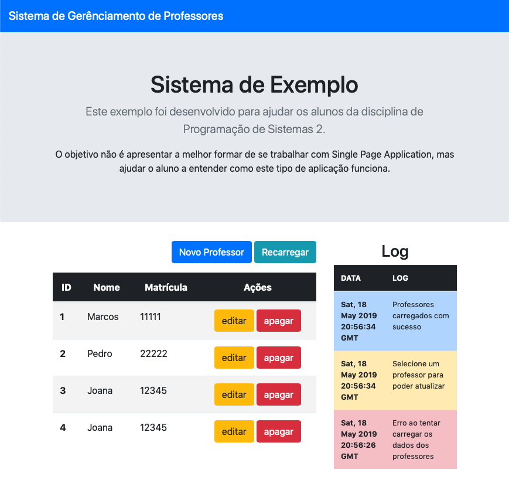

## Objetivo

Este projeto tem por objetivo mostrar um exemplo de Single Page Application utilizando Bootstrap 4 e JavaScript básico.

Esta versão não precisa ter um Banco de Dados configurado.

### Como rodar

- Utilizando NetBeans execute este projeto **2019.01_Professores-WebService**
- Acesse no seu navegador a URL: [http://localhost:8080](http://localhost:8080/index.html)
- A seguinte tela deve aparecer:

- Os dois botões, Azul e Verde, servem respectivamente para criar um nogo registro de professor e recarregar "manualmente" a lista da primeira tabela
- A primeira tabela (esquerda) mostra a lista de professores cadastrados. PS: essa lista não esta salva no banco de dados e sim em memória, logo, se o servidor for parado e executado novamente os dados voltam ao estado original.
- Em cada uma das linhas da primeira tabela é possível executar as ações de editar e apagar de um professor.
- A segunda tabela (direita) apresenta um *log* das ações executadas pelo código JavaScript.
